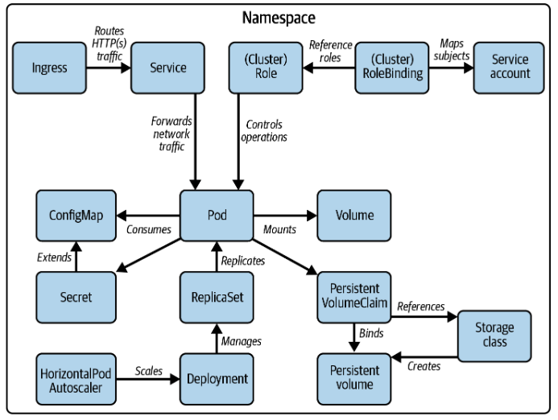

# 쿠버네티스 기본 API 리소스

---

#### 시험과 관련된 쿠버네티스 기능

---
- [Pod](https://kubernetes.io/ko/docs/concepts/workloads/pods/)
- [NameSpace](https://kubernetes.io/ko/docs/concepts/overview/working-with-objects/namespaces/)
- [ReplicaSet](https://kubernetes.io/ko/docs/concepts/workloads/controllers/replicaset/)
- [Deployment](https://kubernetes.io/ko/docs/concepts/workloads/controllers/deployment/)
- [Horizontal Pod AutoScaler](https://kubernetes.io/ko/docs/tasks/run-application/horizontal-pod-autoscale/)
- [ConfigMap](ncepts/configuration/configmap/)
- [Secret](https://kubernetes.io/ko/docs/concepts/configuration/secret/)
- [Service](https://kubernetes.io/ko/docs/concepts/services-networking/service/)
- [Ingress](https://kubernetes.io/ko/docs/concepts/services-networking/ingress/)
- [Volume](https://kubernetes.io/ko/docs/concepts/storage/volumes/)
- [Persistent Volume](https://kubernetes.io/ko/docs/concepts/storage/persistent-volumes/)
- [Storage Class](https://kubernetes.io/ko/docs/concepts/storage/storage-classes/)
- [RBAC](https://kubernetes.io/docs/reference/access-authn-authz/rbac/)
- [Service Account](https://kubernetes.io/ko/docs/reference/access-authn-authz/service-accounts-admin/)