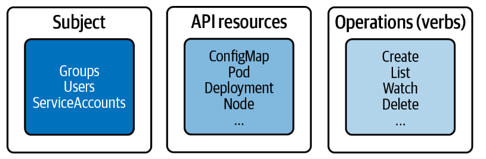
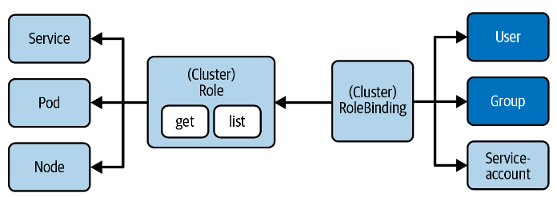

# 역할 기반 액세스 제어 (RBAC)

## RBAC 이란?

**권한 관리**

쿠버네티스에서는 Pod, Namespace 등의 API 리소스에 대한 요청을 허용하기 전에 인증을 받아야 한다. 우리가 인터넷 쇼핑몰에서 주문을 하기 위해서는 회원가입을 하고 로그인을 해야 하는 것과 마찬가지로 쿠버네티스 관리자는 사용자, 그룹등을 생성하고 그들에게 리소스를 읽고 쓸 수 있는 권한을 부여할 수 있다. 

쿠버네티스 관리자는 전체 액세스 권한을 가지고 특정 사용자에게는 역할에 따라 읽기 권한만 부여할 수 있다. 예를들어 애플리케이션 개발자는 클러스터 노드를 관리할 필요가 없기 때문에 단지 `read-only` 권한만 가져도 충분하다.

이렇게 RBAC은 API 리소스 관리에 대한 액세스를 허용하거나 허용하지 않음으로써 `사용자`, `그룹` 및 `프로세스`에 대한 정책을 정의한다. 보안에 중점을 둔 클러스터의 경우 RBAC의 규칙을 정하는 것은 아주 중요하다.

---

**RBAC의 목적**
  
  - 다양한 역할을 가진 사용자가 쿠버네티스 리소스에 권한을 가지고 접근할 수 있는 시스템 구축

  - Pod에서 실행되는 프로세스 및 쿠버네티스 API를 통해 수행할 수 있는 작업 제어

  - 네임스페이스 당 특정 리소스의 Visibility 제한

---
**RBAC의 핵심 요소**



- **`Subject`** : 리소스를 사용하려는 사용자
  - Users, Groups, ServiceAccounts 
- **`API Resources`** : 쿠버네티스에서 제공하는 개체
  - Pod, Node, Deployment, ConfigMap, Secret 등
- **`Operation`** : 리소스에 대한 동작 (CRUD)
  - Create, List, Watch, Delete

---

**Subject 유형**

RBAC 컨텍스트에서 사용자, 그룹, 서비스계정을 주제로 사용할 수 있다. 
- `사용자` 및 `그룹`은 쿠버네티스의 데이터베이스인 etcd에 저장되지는 않으며 클러스터 **외부**에서 실행되는 프로세스를 위한 것이다. 
- `서비스 계정`은 쿠버네티스에서 개체로 존재하며 클러스터 **내부**에서 실행되는 프로세스에서 사용된다.
---

**사용자 계정 및 그룹**

- 사용자는 관리자에 의해 관리되며 계정의 **인증정보(Credential)** 를 외부 사람이나 프로세스에 배포할 수 있다.

- 사용자 계정의 경우 API 서버에 대한 호출시 **인증**이 필요하다. 쿠버네티스는 이러한 요청에 대해 다양한 인증 방법을 제공한다.

<br>

| 인증 전략 | 설명 |
|:--------|:-----|
|X.509 client certificate| OpenSSL 클라이언트 인증서를 사용하여 인증하기|
| Basic Authentication | 사용자명과 패스워드를 사용하여 인증하기|
| Bearer tokens | Oauth2와 같은 OpenID나 Webhook을 통한 토큰 인증 방식|


---
**OpenSSL 클라이언트 인증서를 사용하여 인증하기**

- 사용자 생성을 위해서 관리자 권한이 필요하다.
- 시험에서는 이미 관련 설정이 되어있어서 사용자를 직접 생성할 필요가 없기 때문에 이 단계를 생략할 수 있다.

1. 쿠버네티스 ControlPlane 노드에 접속하고 생성된 키를 보관할 임시 디렉토리를 생성하고 이동한다.
   
```shell
$ mkdir cert && cd cert
```

2. [openssl](https://www.openssl.org/source/)을 사용하여 private key를 생성한다. 
   
```shell
$ openssl genrsa -out -out ithingv34.key 2048
Generating RSA private key, 2048 bit long modulus
..............................+
..+
e is 65537 (0x10001)
$ ls
ithingv34.key
```
3. Certificate Sign Request(CSR) 생성하기
   - `-subj` 옵션에 `사용자명(CN)`, `그룹명(O)`을 붙임
   - 유저를 그룹에 할당하는 것을 막기 위해 `/O` 를 남긴다.

```shell
$ openssl req -new -key ithingv34.key -out ithingv34.csr -subj "/CN=ithingv34/O=cka"
$ ls
ithingv34.csr ithingv34.key
```

4. Kubernetes cluster certificate authority(CA)로 CSR에 서명한다. CA는 보통 `/etc/kubernetes/pki`에 `ca.crt`, `ca.key` 파일이 저장되어 있다. minikube의 경우 다음처럼 입력하며 인증서는 364일간 유효하다.

```shell
$ openssl x509 -req -in ithingv34.csr -CA /.minikube/ca.crt -CAkey \
   /.minikube/ca.key -CAcreateserial -out ithingv34.crt -days 364
Signature ok
subject=/CN=ithingv34/O=cka
Getting CA Private Key
```
   
5. `kubeconfig`에서 사용자 항목을 설정하여 쿠버네티스에서 사용자를 만든다. 
    - crt, key 파일을 지정해야한다.
    - username에 대한 context를 지정해야한다.
```shell
$ kubectl config set-credentials ithingv34 \
  --client-certificate=ithingv34.crt --client-key=ithingv34.key
User "ithingv34" set.

$ kubectl config set-context ithingv34-context --cluster=minikube \
  --user=ithingv34
Context "ithingv34-context" modified.
```

6. 사용자를 변경할 경우에는 `ithingv34-context`라는 컨텍스트를 사용하면 된다. 현재 사용중인 컨텍스트를 확인할 때는 `current-context`를 입력한다.
   
```shell
$ kubectl config use-context ithingv34-context
Switched to context "ithingv34-context".

$ kubectl config current-context
ithingv34-context
```

## ServiceAccount

사용자는 `kubectl` 이나 UI 대시보드를 사용하여 클러스터와 상호작용할 수 있다. 그런데 Pod와 같은 쿠버네티스 객체 내부에서 실행되는 [Helm](https://helm.sh/ko/)과 같은 일부 서비스 애플리케이션은 Restful HTTP 호출을 통해 API 서버에 요청을 함으로써 쿠버네티스 클러스와 상호작용한다.

예를들어, Helm chart는 비즈니스 애플리케이션에 필요한 여러 쿠버네티스 객체를 정의한다. 쿠버네티스 `ServiceAccount` 를 사용하여 인증 토큰을 통해 API 서버와 함께 Helm 서비스 프로세스를 인증한다. 이 서비스 계정을 Pod에 할당하고 RBAC 규칙에 매핑할 수 있다.

쿠버네티스 클러스터는 따로 지정하지 않는 경우 `default` 네임스페이스에 있는 `ServiceAccount`와 함께 제공된다.


- **ServiceAccount 생성** 

```shell
$ kubectl create serviceaccount my-serviceacc
serviceaccount/serviceacc created
```

```markdown
# YAML Manifest
apiVersion: v1
kind: ServiceAccount
metadata:
    name: my-serviceacc
```

- **ServiceAccount 목록**

```shell
$ kubectl get serviceaccounts
NAME            SECRETS   AGE
my-serviceacc       1     78s
default             1     93d
```

- **ServiceAccount 세부정보**
    - ServiceAccount를 생성할 때 API 서버가 토큰을 보유하는 Secret을 생헝하고 이를 ServiceAccount에 할당한다.
    - Secret 및 Token 이름은 ServiceAccount 이름을 접두어로 사용한다.
  
```shell
kubectl describe serviceaccount my-serviceacc
Name:                my-serviceacc
Namespace:           default
Labels:              <none>
Annotations:         <none>
Image pull secrets:  <none>
Mountable secrets:   my-serviceacc-token-rvjnz
Tokens:              my-serviceacc-token-rvjnz
Events:              <none>
```

- **Secret 목록**
```shell
$ kubectl get secrets
NAME                        TYPE                                    DATA   AGE
my-serviceacc-token-rvjnz   kubernetes.io/service-account-token     3      20m
default-token-qgh5n         kubernetes.io/service-account-token     3      93d

```

- **ServiceAccount를 Pod에 할당하기**
  - API를 호출하는 애플리케이션을 실행하는 Pod에 serviceaccount 를 할당할 수 있다.
```shell
$ kubectl run my-pod --image=alpine --restart=Never --serviceaccount=my-serviceacc
pod/my-pod created
```
```shell
# YAML Manifest
apiVersion: v1
kind: Pod
metadata:
  name: my-pod
spec:
  serviceAccountName: my-serviceacc
```

## RBAC API



**Role**
- Role은 쿠버네티스 리소스에 대한 권한들을 명시해둔 규칙들의 **집합**이다. 
- `Role`과 `ClusterRole` 2가지 종류가 있다. 
- Role은 그 **Role이 속한 네임스페이스 한 곳**에만 적용된다. 
- `ClusterRole`은 특정 네임스페이스에 대한 권한이 아닌 **클러스터 전체에 대한 권한**을 관리한다.
- 네임스페이스에 한정되지 않는 자원 및 API들에 대한 권한을 지정할 수도 있다. ex) 특정 노드 혹은 엔드포인트에 대한 권한

**RoleBinding**
- RoleBinding은 Role과 사용자를 묶어주는 역할을 한다. 
- 마찬가지로 RoleBinding은 특정 네임스페이스 한 곳에 적용되며 ClusterRoleBinding은 클러스터 전체에 걸쳐 적용된다.

---
- **Role 생성하기**
    - `--verb` : 가능한 작업을 명시한다.

    | verb | 의미 |
    |:----|:----|
    |create| 새로운 리소스 생성|
    |get|개별 리소스 조회|
    |list| 여러건의 리소스 조회|
    |update| 기존 리소스내용 전체 업데이트|
    |patch| 기존 리소스중 일부 내용 변경|
    |delete| 개별 리소스 삭제|
    |deletecollection | 여러 리소스 삭제|

    - `--resource` :  API 리소스의 목록을 정의한다.
    - 리소스 목록을 제공하지 않으면 모든 리소스 유형에 적용된다.
    - 예시는 `read-only`라는 역할명을 가지고 pods, deployments, services 리소스에 `list`, `get`, `watch` 작업이 가능한 역할이다.
```shell
$ kubectl create role read-only --verb=list,get,watch \
  --resource=pods,deployments,services

role.rbac.authorization.k8s.io/read-only created
```
```shell
# YAML manifest
apiVersion: rbac.authorization.k8s.io/v1
kind: Role
metadata:
  name: read-only
rules:
- apiGroups:
  - ""
  resources:
  - pods
  - services
  verbs:
  - list
  - get
  - watch
- apiGroups:
  - apps
  resources:
  - deployments
  verbs:
  - list
  - get
  - watch

```

- **Role 목록**
```shell
$ kubectl get roles
NAME        CREATED AT
read-only   2022-12-21T19:46:48Z
```

- **Role 세부내용**
  - 리소스를 허용하는 동사에 매핑하는 테이블을 렌더링한다.
  - 이 클러스터에는 생성된 리소스가 없으므로 리소스 이름 목록이 비어있다.
```shell
Name:         read-only
Labels:       <none>
Annotations:  <none>
PolicyRule:
  Resources         Non-Resource URLs  Resource Names  Verbs
  ---------         -----------------  --------------  -----
  pods              []                 []              [list get watch]
  services          []                 []              [list get watch]
  deployments.apps  []                 []              [list get watch]
```

---
- **RoleBinding 생성**
  
  - Role을 RoleBinding에 묶으려면 `--role` 옵션을 사용한다.
  - `--user`, `--group`, `--serviceaccount`에 옵션에 원하는 사용자명을 입력할 수 있다.

```shell
kubectl create rolebinding read-only-binding --role=read-only --user=ithingv34
rolebinding.rbac.authorization.k8s.io/read-only-binding created
```

```shell
# YAML Manifest
apiVersion: rbac.authorization.k8s.io/v1
kind: RoleBinding
metadata:
  name: read-only-binding
roleRef:
  apiGroup: rbac.authorization.k8s.io
  kind: Role
  name: read-only
subjects:
- apiGroup: rbac.authorization.k8s.io
  kind: User
  name: ithingv34
```

- **RoleBinding 목록**
```shell
$ kubectl get rolebindings
NAME                ROLE             AGE
read-only-binding   Role/read-only   24h
```

- **RoleBinding 세부내용**
```shell
$ kubectl describe rolebinding read-only-binding
Name:         read-only-binding
Labels:       <none>
Annotations:  <none>
Role:
  Kind:  Role
  Name:  read-only
Subjects:
  Kind  Name     Namespace
  ----  ----     ---------
  User  ithingv34
```

- **ClusterRole, ClusterRoleBinding 생성**
```shell
$ kubectl create clusterrole read-only-role --verb=list,get,watch \ --resource=pods,deployments,services
clusterrole.rbac.authorization.k8s.io/read-only-role created


$ kubectl create clusterrolebinding read-only-role-binding --clusterrole=read-only-role --user=ithingv34
clusterrolebinding.rbac.authorization.k8s.io/read-only-role-binding created
```

----

**실제로 RBAC 규칙 적용해보기**

- 현재 컨텍스트는 `minikube`
- nginx 이미지를 myapp이라는 이름으로 80번 포트에 2개의 replica를 가지는 pod를 배포
  
```shell
$ kubectl config current-context
minikube

$ kubectl create deployment myapp --image=nginx --port=80 --replicas=2
deployment.apps/myapp created
```

1. 유저(ithingv34) 컨텍스트로 전환하기

```shell
$ kubectl config use-context ithingv34-context
Switched to context "ithingv34-context".
```

2. 배포된 deployments 확인하기
   - 유저 ithingv34는 deployment 리소스에 대해 list 작업이 가능한 상태

```shell
$ kubectl get deployments
NAME    READY   UP-TO-DATE   AVAILABLE   AGE
myapp   2/2     2            2           8s
```

3. 유저가 가진 권한들을 확인하는 명령어 (`auth can-i`)
```shell
$ kubectl auth can-i --list --as ithingv34
Resources          Non-Resource URLs   Resource Names   Verbs
...
pods               []                  []               [list get watch]
services           []                  []               [list get watch]
deployments.apps   []                  []               [list get watch]
$ kubectl auth can-i list pods --as ithingv34
yes
```

----

