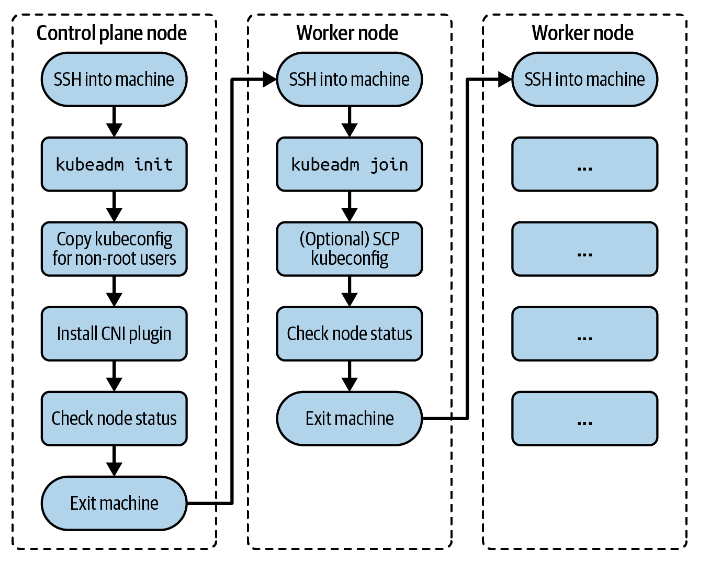

# 클러스터 설치

**kubeadm**
- 저수준의 커맨드라인 도구인 `kubeadm`을 사용하여 클러스터를 설치할 수 있다.
  - [kubeadm 설치 문서](https://kubernetes.io/ko/docs/setup/production-environment/tools/kubeadm/install-kubeadm/)
- 시험에는 `kubeadm`이 미리 설치됐다고 가정한다.
---

**클러스터 설치 과정**


**ControlPlane 노드 초기화**
- ControlPlane은 API 서버, etcd 등 쿠버네티스 클러스터를 관리하는데 필요한 여러 컴포넌트를 호스팅하는 역할을 담당한다.
  
1. 우선 `ssh` 명령어로 ControlPlane 노드에 대한 쉘을 연다.
   - control plane node의 이름은 `kube-control-plane`
   - OS: Ubuntu 18.04.5 LTS

```shell
$ ssh kube-control-plane
Welcome to Ubuntu 18.04.5 LTS (GNU/Linux 4.15.0-132-generic x86_64)
```
  
2. `kubeadm init` 명령어를 사용하여 ControlPlane을 초기화한다. 그리고 다음 두 가지 옵션을 추가하여 Pod 네트워크의 IP 주소를 제공해야한다.
   - 1. `--pod-network-cidr` : Classless Inter Domain Routing
   - 2. `--apiserver-advertise-address` : API 서버 IP주소

- 콘솔의 아웃풋은 `kubeadm join` 명령어를 렌더링한다. 이는 워커 노드들을 클러스터에 연결하는데 필요하다.

```shell
$ sudo kubeadm init --pod-network-cidr 172.18.0.0/16 \
  --apiserver-advertise-address 10.8.8.10

To start using your cluster, you need to run the following as a regular user:

  mkdir -p $HOME/.kube
  sudo cp -i /etc/kubernetes/admin.conf $HOME/.kube/config
  sudo chown $(id -u):$(id -g) $HOME/.kube/config

You should now deploy a pod network to the cluster.
Run "kubectl apply -f [podnetwork].yaml" with one of the options listed at:
  https://kubernetes.io/docs/concepts/cluster-administration/addons/

Then you can join any number of worker nodes by running the following on \
each as root:

kubeadm join 10.8.8.10:6443 --token fi8io0.dtkzsy9kws56dmsp \
    --discovery-token-ca-cert-hash \
    sha256:cc89ea1f82d5ec460e21b69476e0c052d691d0c52cce83fbd7e403559c1ebdac
```

3. 명령이 완료되면 방금 콘솔의 `init` 아웃풋에서 나온 명령어를 실행하여 루트가 아닌 사용자로 클러스터를 시작한다.

```shell
$ mkdir -p $HOME/.kube
$ sudo cp -i /etc/kubernetes/admin.conf $HOME/.kube/config
$ sudo chown $(id -u):$(id -g) $HOME/.kube/config
```

4. Pod가 서로 통신할 수 있도록 [CNI(컨테이너 네트워크 인터페이스) 플러그인](https://kubernetes.io/ko/docs/concepts/extend-kubernetes/compute-storage-net/network-plugins/)을 배포해야한다. [쿠버네티스 문서](https://kubernetes.io/docs/concepts/cluster-administration/addons/#networking-and-network-policy)에 있는 `Flannel`, `Calico` , `Weave` 와 같은 인기있는 Plugin을 선택할 수 있다.
    - CKA 시험에서는 특정 추가 기능을 설치하도록 요청할 가능성이 높다.
    - 다음은 Weave CNI의 설치 지침을 따른 것이다.
```shell
$ kubectl apply -f "https://cloud.weave.works/k8s/net?k8s-version= \
  $(kubectl version | base64 | tr -d '\n')"
serviceaccount/weave-net created
clusterrole.rbac.authorization.k8s.io/weave-net created
clusterrolebinding.rbac.authorization.k8s.io/weave-net created
role.rbac.authorization.k8s.io/weave-net created
rolebinding.rbac.authorization.k8s.io/weave-net created
daemonset.apps/weave-net created
```

5. ControlPlane 노드가 `Ready` 상태인지 확인하자. `NotReady` 상태에서 `Ready` 상태로 바뀌기까지 시간이 걸린다.

```shell
$ kubectl get nodes
NAME                 STATUS   ROLES                  AGE   VERSION
kube-control-plane   Ready    control-plane,master   24m   v1.21.2
```
6. ControlPlane에서 exit 한다.
```shell
$ exit
logout
...
```
---
**Worker Node 결합하기**

Worker 노드는 ControlPlane에서 예약한 워크로드를 처리한다. 워크로드의 예로 Pod, Deployments, Job, CronJob 등이 있다. Worker 노드를 ControlPlane 노드에 연결하기 위해서는 몇가지 작업이 필요하다.

1. 우선 `ssh` 명령어로 Worker 노드에 대한 쉘을 연다.
   - control plane node의 이름은 `kube-worker-1`
   - OS: Ubuntu 18.04.5 LTS

```shell
$ ssh kube-worker-1
Welcome to Ubuntu 18.04.5 LTS (GNU/Linux 4.15.0-132-generic x86_64)
...
```

2. ControlPlane에서 실행한 `kubeadm init` 명령어의 아웃풋에서 나온 `kubeadm join` 명령어를 실행한다.
    - 토큰값과 SHA256 hash 값은 다를 수 있다.

```shell
$ sudo kubeadm join 10.8.8.10:6443 --token fi8io0.dtkzsy9kws56dmsp \
  --discovery-token-ca-cert-hash \
  sha256:cc89ea1f82d5ec460e21b69476e0c052d691d0c52cce83fbd7e403559c1ebdac
[preflight] Running pre-flight checks
[preflight] Reading configuration from the cluster...
[preflight] FYI: You can look at this config file with \
'kubectl -n kube-system get cm kubeadm-config -o yaml'
[kubelet-start] Writing kubelet configuration to file \
"/var/lib/kubelet/config.yaml"
[kubelet-start] Writing kubelet environment file with \
flags to file "/var/lib/kubelet/kubeadm-flags.env"
[kubelet-start] Starting the kubelet
[kubelet-start] Waiting for the kubelet to perform the TLS Bootstrap...

This node has joined the cluster:
* Certificate signing request was sent to apiserver and a response was received.
* The Kubelet was informed of the new secure connection details.

Run 'kubectl get nodes' on the control plane to see this node join the cluster.

```

3. ContolPlane 노드에 접속해서 `kubectl get nodes` 를 입력한다.

```shell
$ ssh kube-control-plane
Welcome to Ubuntu 18.04.5 LTS (GNU/Linux 4.15.0-132-generic x86_64)
...
$ kubectl get nodes
NAME                 STATUS   ROLES                  AGE     VERSION
kube-control-plane   Ready    control-plane,master   5h49m   v1.21.2
kube-worker-1        Ready    <none>                 15m     v1.21.2
```

4. 과정을 따라오면서 문제가 생겼다면 [공식 문서](https://kubernetes.io/docs/setup/production-environment/tools/kubeadm/create-cluster-kubeadm/#optional-controlling-your-cluster-from-machines-other-than-the-control-plane-node)를 참고하자.