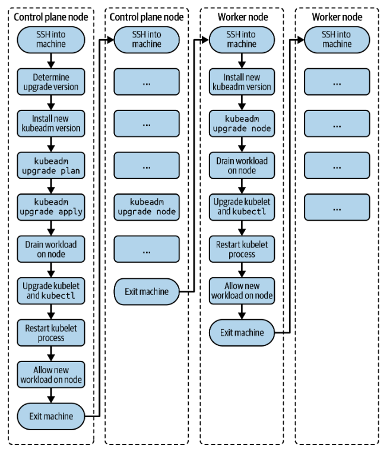

# 클러스터 버전 업그레이드

기존 클러스터의 버그 수정 및 새로운 기능 추가를 위하여 클러스터 버전을 업그레이드 할 수 있다.

:::danger
**업그레이드는** 현재 실행 중인 워크로드의 중단을 피하고 클러스터 노드의 손상을 막기 위해 통제된 방식으로 수행되어야 한다. 
:::

**업그레이드 과정**



:::warning
고가용성을 위해 여러 개의 클러스터를 사용하는 경우 한 번에 하나씩 Control Plane 노드를 업그레이드 해야 한다.

:::

---
**Master 노드 업그레이드**

1. 먼저 Control Plane 노드에 `ssh`로 접속해야한다. 
   - 여러개의 Control Plane 중에서 `kubeconfig` 파일 (`/etc/kubernetes/admin.conf`)을 가지고 있는 Control Plane을 선택한다.

```shell
$ ssh kube-control-plane
Welcome to Ubuntu 18.04.5 LTS (GNU/Linux 4.15.0-132-generic x86_64)
...

```

2. 쿠버네티스 버전을 확인한다.
   - 현재 버전은 1.18.0 
   - 이번 예제에서는 단일 클러스터, 단일 워커 노드로 업그레이드를 진행한다.
  
```shell
$ kubectl get nodes
NAME                 STATUS   ROLES    AGE     VERSION
kube-control-plane   Ready    master   4m54s   v1.18.0
kube-worker-1        Ready    <none>   3m18s   v1.18.0
```

3. `kubeadm` 버전을 업그레이드
    - target 버전은 1.19.0-00
   
```
# 설치 가능한 패키지 리스트를 최신화
$ sudo apt update
# 업그레이드할 버전을 확인
$ sudo apt-cache madison kubeadm
    kubeadm |  1.21.2-00 | http://apt.kubernetes.io kubernetes-xenial/main \
   amd64 Packages
   kubeadm |  1.21.1-00 | http://apt.kubernetes.io kubernetes-xenial/main \
   amd64 Packages
   kubeadm |  1.21.0-00 | http://apt.kubernetes.io kubernetes-xenial/main \
   amd64 Packages
   kubeadm |  1.20.8-00 | http://apt.kubernetes.io kubernetes-xenial/main \
   amd64 Packages
   kubeadm |  1.20.7-00 | http://apt.kubernetes.io kubernetes-xenial/main \
   amd64 Packages
   kubeadm |  1.20.6-00 | http://apt.kubernetes.io kubernetes-xenial/main \
   amd64 Packages
   kubeadm |  1.20.5-00 | http://apt.kubernetes.io kubernetes-xenial/main \
   amd64 Packages
   kubeadm |  1.20.4-00 | http://apt.kubernetes.io kubernetes-xenial/main \
   amd64 Packages
   kubeadm |  1.20.2-00 | http://apt.kubernetes.io kubernetes-xenial/main \
   amd64 Packages
   kubeadm |  1.20.1-00 | http://apt.kubernetes.io kubernetes-xenial/main \
   amd64 Packages
   kubeadm |  1.20.0-00 | http://apt.kubernetes.io kubernetes-xenial/main \
   amd64 Packages
```

4. `kubeadm`을 1.19.0-00 버전으로 업그레이드

```shell
$ sudo apt-mark unhold kubeadm && sudo apt-get update && sudo apt-get install \
  -y kubeadm=1.19.0-00 && sudo apt-mark hold kubeadm

Canceled hold on kubeadm.
...
Unpacking kubeadm (1.19.0-00) over (1.18.0-00) ...
Setting up kubeadm (1.19.0-00) 
...
kubeadm set on hold.

$ sudo apt-get update && sudo apt-get install -y --allow-change-held-packages \
  kubeadm=1.19.0-00
...
kubeadm is already the newest version (1.19.0-00).
0 upgraded, 0 newly installed, 0 to remove and 7 not upgraded.
$ kubeadm version
kubeadm version: &version.Info{Major:"1", Minor:"19", GitVersion:"v1.19.0", \
GitCommit:"e19964183377d0ec2052d1f1fa930c4d7575bd50", GitTreeState:"clean", \
BuildDate:"2022-12-27T14:28:32Z", GoVersion:"go1.15", Compiler:"gc", \
Platform:"linux/amd64"}

```

5. 현재 클러스터를 업그레이드 할 수 있는지 버전을 확인한다.
    - 현재 버전: 1.18.20
    - kubeadm 버전: 1.19.0
    - 1.19.12로 업그레이드가 가능하다.
```shell
$ sudo kubeadm upgrade plan

...
[upgrade] Fetching available versions to upgrade to
[upgrade/versions] Cluster version: v1.18.20
[upgrade/versions] kubeadm version: v1.19.0
I0708 17:32:53.037895   17430 version.go:252] remote version is much newer: \
v1.21.2; falling back to: stable-1.19
[upgrade/versions] Latest stable version: v1.19.12
[upgrade/versions] Latest version in the v1.18 series: v1.18.20
...
You can now apply the upgrade by executing the following command:

	kubeadm upgrade apply v1.19.12

Note: Before you can perform this upgrade, you have to update kubeadm to v1.19.12.
```

6. 1.19.0으로 업그레이드 적용
    - 시간이 몇 분 걸릴 수 있다.
    - CNI 플러그인도 업그레이드가 필요할 수 있다.

```shell
$ sudo kubeadm upgrade apply v1.19.0
...
[upgrade/version] You have chosen to change the cluster version to "v1.19.0"
[upgrade/versions] Cluster version: v1.18.20
[upgrade/versions] kubeadm version: v1.19.0
...
[upgrade/successful] SUCCESS! Your cluster was upgraded to "v1.19.0". Enjoy!

[upgrade/kubelet] Now that your control plane is upgraded, please proceed \
with upgrading your kubelets if you haven't already done so.

```

7. ControlPlane 노드를 `Drain`해서 워크로드를 제거한다. `uncordoned` 될 때 까지 워크로드가 스케줄링 되지 않는다.

 ```shell
 $ kubectl drain kube-control-plane --ignore-daemonsets
node/kube-control-plane cordoned
WARNING: ignoring DaemonSet-managed Pods: kube-system/calico-node-qndb9, \
kube-system/kube-proxy-vpvms
evicting pod kube-system/calico-kube-controllers-65f8bc95db-krp72
evicting pod kube-system/coredns-f9fd979d6-2brkq
pod/calico-kube-controllers-65f8bc95db-krp72 evicted
pod/coredns-f9fd979d6-2brkq evicted
node/kube-control-plane evicted
```

8. kubelet과 kubectl을 동일한 버전으로 업그레이드 

```shell
$ sudo apt-mark unhold kubelet kubectl && sudo apt-get update && sudo \
  apt-get install -y kubelet=1.19.0-00 kubectl=1.19.0-00 && sudo apt-mark \
  hold kubelet kubectl
...
Setting up kubelet (1.19.0-00) ...
Setting up kubectl (1.19.0-00) ...
kubelet set on hold.
kubectl set on hold.
```

9. kubelet 프로세스를 재시작
    
```shell
$ sudo systemctl daemon-reload
$ sudo systemctl restart kubelet
```

10. Drain 됐던 control plane을 uncordon 한다.

```shell
$ kubectl uncordon kube-control-plane
node/kube-control-plane uncordoned
```

11. Control Plane 노드 버전 확인
```
$ kubectl get nodes
NAME                 STATUS   ROLES    AGE   VERSION
kube-control-plane   Ready    master   21h   v1.19.0
kube-worker-1        Ready    <none>   21h   v1.18.0
```

12. 로그아웃
```
$ exit
logout
```

---- 

**Worker 노드 업그레이드**

1. Worker 노드 중 하나를 선택하고 ssh로 접속한다.
   
```shell
$ ssh kube-worker-1
Welcome to Ubuntu 18.04.5 LTS (GNU/Linux 4.15.0-132-generic x86_64)
...
```

2. `kubeadm` target 버전으로 업그레이드 한다. 
    - master node에서 했던 것과 동일한 명령이다.
```
$ sudo apt-mark unhold kubeadm && sudo apt-get update && sudo apt-get install \
  -y kubeadm=1.19.0-00 && sudo apt-mark hold kubeadm

Canceled hold on kubeadm.
...
Unpacking kubeadm (1.19.0-00) over (1.18.0-00) ...
Setting up kubeadm (1.19.0-00) ...
kubeadm set on hold.
$ kubeadm version
kubeadm version: &version.Info{Major:"1", Minor:"19", GitVersion:"v1.19.0", \
GitCommit:"e19964183377d0ec2052d1f1fa930c4d7575bd50", GitTreeState:"clean", \
BuildDate:"2022-12-27T14:28:32Z", GoVersion:"go1.15", Compiler:"gc", \
Platform:"linux/amd64"}
```

3. kubelet configuration을 업그레이드한다.
```shell
$ sudo kubeadm upgrade node

[upgrade] Reading configuration from the cluster...
[upgrade] FYI: You can look at this config file with 'kubectl -n kube-system \
get cm kubeadm-config -o yaml'
[preflight] Running pre-flight checks
[preflight] Skipping prepull. Not a control plane node.
[upgrade] Skipping phase. Not a control plane node.
[kubelet-start] Writing kubelet configuration to file \
"/var/lib/kubelet/config.yaml"
[upgrade] The configuration for this node was successfully updated!
[upgrade] Now you should go ahead and upgrade the kubelet package using your \
package manager.

```

4. 업그레이드할 노드를 drain한다.
```shell
$ kubectl drain kube-worker-1 --ignore-daemonsets

node/kube-worker-1 cordoned
WARNING: ignoring DaemonSet-managed Pods: kube-system/calico-node-2hrxg, \
kube-system/kube-proxy-qf6nl
evicting pod kube-system/calico-kube-controllers-65f8bc95db-kggbr
evicting pod kube-system/coredns-f9fd979d6-7zm4q
evicting pod kube-system/coredns-f9fd979d6-tlmhq
pod/calico-kube-controllers-65f8bc95db-kggbr evicted
pod/coredns-f9fd979d6-7zm4q evicted
pod/coredns-f9fd979d6-tlmhq evicted
node/kube-worker-1 evicted
```

5. kubelet과 kubectl을 업그레이드한다.

```shell
$ sudo apt-mark unhold kubelet kubectl && sudo apt-get update && sudo apt-get \
install -y kubelet=1.19.0-00 kubectl=1.19.0-00 && sudo apt-mark hold kubelet \
kubectl

...
Setting up kubelet (1.19.0-00) ...
Setting up kubectl (1.19.0-00) ...
kubelet set on hold.
kubectl set on hold.
```

6. kubelet 프로세스를 재시작한다.
```shell
$ sudo systemctl daemon-reload
$ sudo systemctl restart kubelet
```

7. 노드를 uncordon한다.
```shell
$ kubectl uncordon kube-worker-1
node/kube-worker-1 uncordoned
```

8. 새로운 버전인 1.19.0가 노드에도 적용됐는지 확인한다.
```shell
$ kubectl get nodes
NAME                 STATUS   ROLES    AGE   VERSION
kube-control-plane   Ready    master   24h   v1.19.0
kube-worker-1        Ready    <none>   24h   v1.19.0
```

9. 로그아웃
```shell
$ exit
logout
...
```
