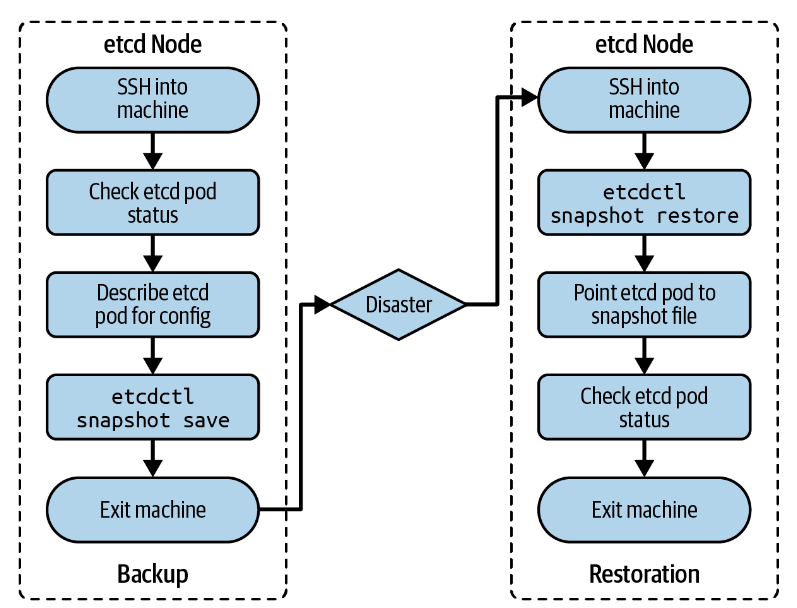

# etcd DB 백업 및 복원

<br>

- 쿠버네티스는 분산된 etcd Key-Value 저장소에 클러스터의 **선언된 상태**(declared state)와 **관찰된 상태**(observed state)를 모두 저장한다.
- 데이터가 손상된 경우 데이터를 복원하기 위해 **백업 계획**을 마련하는 것이 중요하다.
- 데이터 백업은 데이터 손실을 최소화하기 위해 짧은 시간 내에 주기적으로 수행돼야 한다.
- `스냅샷 파일`에 etcd 데이터를 저장하고 언제든지 복원할 때 사용할 수 있다.

----

**etcd 백업 & 복원 프로세스**



:::warning
클러스터 토폴로지에 따라 하나 이상의 etcd 인스턴스로 구성될 수 있다. 이 예제에서는 단일 노드 etcd 클러스터 설정에 대해 설명한다. 자세한 내용은 [공식 문서](https://kubernetes.io/docs/tasks/administer-cluster/configure-upgrade-etcd/)를 참고한다.
:::


**백업**

1. etcd를 호스팅하는 시스템 노드에 ssh로 접속한다.
   
```shell
$ ssh kube-control-plane
Welcome to Ubuntu 18.04.5 LTS (GNU/Linux 4.15.0-132-generic x86_64)
...

```

2. etcdctl 버전을 체크한다.
   - 현재 3.4.14 버전
```shell
$ etcdctl version
etcdctl version: 3.4.14
API version: 3.4
```

3. etcd는 `kube-system` 네임스페이스에 Pod로 배포된 상태이다. Pod에  describe 명령어를 사용해 version을 확인해보자.

```shell
$ kubectl get pods -n kube-system
NAME                                       READY   STATUS    RESTARTS   AGE
...
etcd-kube-control-plane                    1/1     Running   0          33m
...
$ kubectl describe pod etcd-kube-control-plane -n kube-system
...
Containers:
  etcd:
    Container ID:  docker://28325c63233edaa94e16691e8082e8d86f5e7da58c0fb54 \
    d95d68dec6e80cf54
    Image:         k8s.gcr.io/etcd:3.4.3-0
    Image ID:      docker-pullable://k8s.gcr.io/etcd@sha256:4afb99b4690b418 \
    ffc2ceb67e1a17376457e441c1f09ab55447f0aaf992fa646
...
      --cert-file=/etc/kubernetes/pki/etcd/server.crt
      --key-file=/etc/kubernetes/pki/etcd/server.key
      --listen-client-urls=/etc/kubernetes/pki/etcd/server.key
      --trusted-ca-file=/etc/kubernetes/pki/etcd/ca.crt
...
```
- localhost

4. 


---

**etcd 복원**

- 백업에서 etcd를 복원하려면 `etcdctl snapshot restore` 명령