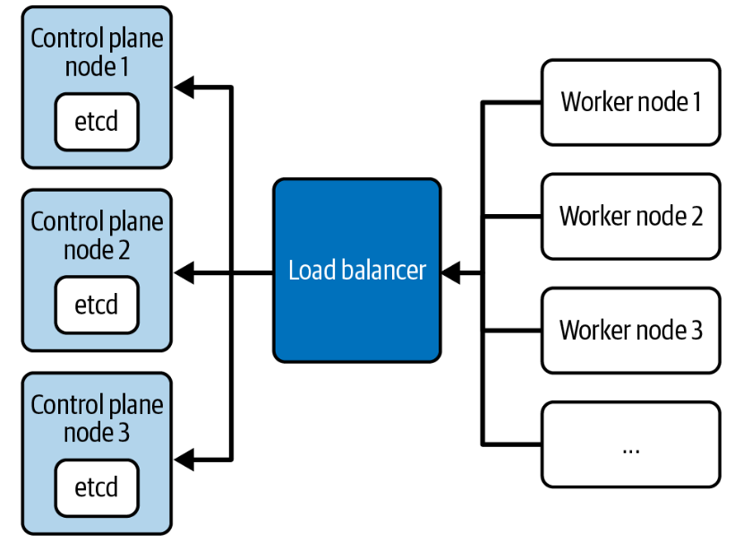
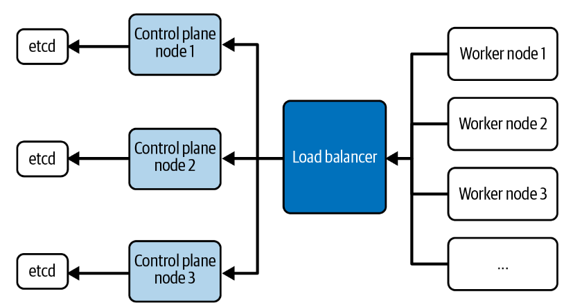

# 클러스터 고가용성(HA) 관리

**단일 클러스터 설치의 한계**
- 프로덕션 레벨에서는 단일 클러스터 보다는 여러개의 클러스터를 설치하는 것이 일반적이다.
- 만약 `Control Plane` 노드에 장애가 발생하면 
`kubectl`로 API에 연결할 수 없어 외부에서 클러스터에 액세스 할 수 없게된다.
- 또한 `Worker` 노드에서 실행 중인 ReplicaSet은 Control Plane에서 실행 중인 스케줄러와 대화할 수 없기 때문에 Pod를 재생성 할 수 없다.

---

**예시**
  
  **1. 3개의 Control Plane 노드가 있는 Stack 형 Etcd 토폴로지**

- etcd가 노드에 함께 배치된 3개의 Control Plane 노드가 생성된다.
- 각 Control Plane 노드는 API 서버, 스케줄러 및 컨트롤러 관리자를 호스팅한다.
- Worker 노드는 로드 밸런서를 통해 API 서버와 통신한다.
- Control Plane에 대한 **긴밀한 결합**으로 인한 중복성을 위해 최소 `3`개의 Control Plane 노드로 클러스터를 구성하는 것이 좋다.
- 기본적으로 `kubeadm` Control Plane 노드를 클러스터에 연결할 때 etcd 인스턴스를 생성한다. 

---

**2. 외부 etcd 노드 토폴로지**

 

- 1번 토폴로지와 달리 etcd를 Control Plane에서 분리하는 토폴로지이다.
- etcd 인스턴스가 별도의 호스트에서 실행된다는 것이 차이점이다.
- 이 토폴로지의 경우 etcd를 다른 Control Plane 기능에서 분리하기 때문에 Control Plane가 손실될 때 중복성이 미치는 영향이 적다.
- 하지만 이 토폴로지는 위의 토폴로지보다 두 배 많은 호스트가 필요하기 때문에 관리 복잡도가 증가한다.

---

**참고자료**

- [고가용성 클러스터 토폴로지 구성하기](https://kubernetes.io/docs/setup/production-environment/tools/kubeadm/ha-topology/)

